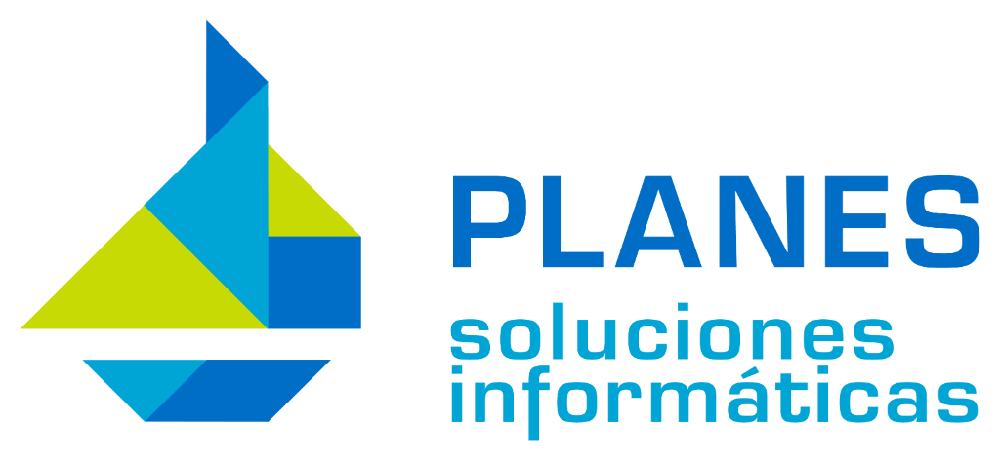

# PlanesGo (v1.0.1)

Aplicación moderna, minimalista y de alto rendimiento en Go para consultar y visualizar de forma interactiva los partes de horas trabajadas (timesheets / `account.analytic.line`) de Odoo.



---

## 🚀 Características

- **Autenticación Prioritaria con Google OAuth 2.0:** Acceso con un solo clic con cuentas de Google / Google Workspace.
- **Acceso alternativo con credenciales Odoo:** Compatible con usuario y contraseña / API Key.
- **Identidad Corporativa Planes:** Diseño visual moderno, funcional y minimalista basado en la marca oficial de **PLANES Soluciones Informáticas**.
- **Reglas de Diseño Centralizadas:** Consulta [`DESIGN.md`](DESIGN.md) para conocer la guía de estilos y tokens visuales.
- **Servidor y Base de Datos Fijos:** Conexión nativa e invariable a `https://www.planesnet.com` (BD: `pasi`).
- **Dashboard Interactivo:**
  - Métricas KPI en tiempo real: Horas totales, partes/filas, proyectos y miembros del equipo.
  - Filtros instantáneos en vivo (búsqueda por texto, filtro por proyecto y empleado).
  - Tabla de registros optimizada de alta legibilidad.
- **API JSON:** Endpoint disponible en `/api/timesheets`.
- **Despliegue con Docker:** Incluye Dockerfile multi-stage ultraligero listo para Autopyme o Kubernetes.

---

## ⚙️ Configuración (`config.yml`)

```yaml
server:
  port: 8080

odoo:
  url: "https://www.planesnet.com"       # URL fija de Odoo
  db: "pasi"                            # Base de datos fija
  username: ""                          # Usuario / Email de Odoo
  password: ""                          # Contraseña o API Key de Odoo
  limit: 200                            # Límite máximo de partes de horas

google_auth:
  enabled: true
  client_id: "TU_CLIENT_ID.apps.googleusercontent.com"      # O variable GOOGLE_CLIENT_ID
  client_secret: "GOCSPX-TU_CLIENT_SECRET"                  # O variable GOOGLE_CLIENT_SECRET
  redirect_url: "http://localhost:8080/auth/google/callback"# URI de redirección autorizada
  allowed_domain: "planesnet.com"                           # Opcional: restringir al dominio de empresa
```

---

## 🏃 Ejecución Local

```bash
# Compilar y ejecutar
go build -o planesgo .
./planesgo
```

---

## 🐳 Ejecución con Docker (Autopyme)

```bash
# Construir imagen Docker
docker build -t planesgo:latest .

# Ejecutar contenedor
docker run -d -p 8080:8080 --name planesgo planesgo:latest
```

Acceso desde el navegador:
👉 **[http://localhost:8080](http://localhost:8080)**
